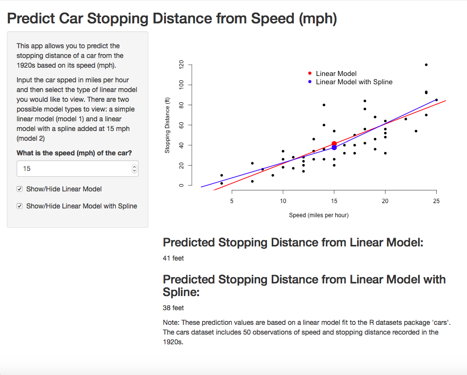

Predict 1920s Car Stopping Distance: A Shiny App Example
========================================================
author: Megan Neisler
date: November 20, 2016
autosize: true

Introduction
========================================================

In the 1920s, stopping or braking distances were recorded for 50 cars travelling at different speeds. 

Reviewing the relationshop between speed and braking distance is used to review speeding laws and car design.

This application allows the user to predict the stopping distance of a car built in the 1920s based on the car's speed in miles per hour (mph).


Data Overview 
========================================================

- Recorded in the 1920s
- Includes 50 observations on 2 variables: speed (mph) and stopping distnace (ft).
- Source: Ezekiel, M. (1930) Methods of Correlation Analysis. Wiley.

Summary of Cars Data


```
     speed           dist       
 Min.   : 4.0   Min.   :  2.00  
 1st Qu.:12.0   1st Qu.: 26.00  
 Median :15.0   Median : 36.00  
 Mean   :15.4   Mean   : 42.98  
 3rd Qu.:19.0   3rd Qu.: 56.00  
 Max.   :25.0   Max.   :120.00  
```

How it Works
========================================================


***
- Input the speed of the 1920s car using the provided input box.
- Select if you would like to view the linear model, linear model 2, or both using the checkboxes.
- The app will display a plot of the selected model and the predicted stopping distance based on the model.


Prediction Models
========================================================
Two types of linears regression model are fit to the cars data set to evaluate the relationship between speed and distance. Model 1 is a simple linear regression model. Model 2 is also a linear regression model but adds a spline term at 15mph.


```r
cars$speedSp <- ifelse(cars$speed - 15 > 0, cars$speed - 15, 0)
 model1 <- lm(dist ~ speed, data = cars)
 model2 <- lm(dist ~ speedSp + speed, data = cars)
```

For more information
========================================================
For more details on the cars dataset, please visit:
<http://stat.ethz.ch/R-manual/R-devel/library/datasets/html/cars.html>.

You can access the shiny app here:
https://meganneisler.shinyapps.io/CarStoppingDistApp/

The server.R and ui.R code is available here:
